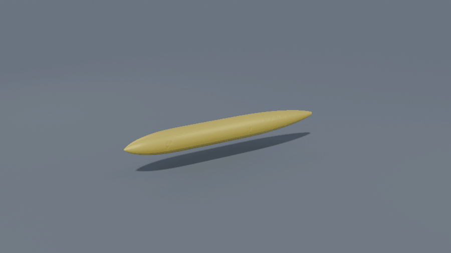

# RealParts

RealParts lets a person and an AI assistant build and edit the same
parametric CAD model together — in Blender, a browser, the Native desktop
app, or from the command line.

A model is a small JSON document. A kernel built on OpenCASCADE turns that
document into a solid, names every face, and measures what it built. So an
assistant's edit can be checked in numbers, and you can pick the model up by
hand at any point.

[](https://github.com/inuex35/realparts/actions/workflows/tests.yml)


<p align="center">
  
</p>
<p align="center"><em>An aircraft asked for in one line, rebuilt from its
document once per feature.</em></p>

## What a part is

A part is a JSON file that holds three things: its sizes, the steps that make
it, and what it must satisfy.

```json
{
  "parameters": {"width": 80, "depth": 50, "thickness": 6, "hole_d": 6.5, "corner_r": 4},
  "features": [
    {"id": "plate",   "type": "box",    "size": ["width", "depth", "thickness"]},
    {"id": "bolt",    "type": "hole",   "body": "plate", "face": "plate/+z", "diameter": "hole_d", "at": [0, 0]},
    {"id": "rounded", "type": "fillet", "body": "bolt", "edges": {"parallel": "z"}, "radius": "corner_r"}
  ],
  "requirements": [
    {"id": "light",  "quantity": "mass_g",    "compare": "<=", "value": 60, "material": "A6061"},
    {"id": "prints", "quantity": "printable", "compare": "==", "value": 1, "min_wall": 2}
  ]
}
```

Every face has a name. `plate/+z` is the top of the plate at any size. So a
hole drilled in it, a fillet on its edges, and a load applied to it all keep
meaning the same thing after the numbers change.

When the assistant thins the plate to 1.5 mm, the kernel answers:

```json
{"ok": true, "result": {
  "face_names": ["plate/+z", "bolt/bore", "rounded/side", "..."],
  "requirements": [
    {"id": "light",  "got": 16.01, "ok": true},
    {"id": "prints", "got": 0.0,   "ok": false}
  ]}}
```

Light enough, but too thin to print. Those numbers came from the kernel, not
from the assistant.

## Start here

- **Downloads and releases** — [docs/releases.md](docs/releases.md) explains
  the separate Web, Native and Blender packages and their GitHub release tags.
- **Using it** — [docs/README.md](docs/README.md) walks from install to your
  first part, editing it, saving, and exporting. For the ten-minute version
  with pictures, see [docs/how-to.md](docs/how-to.md).
- **Working on it** — [docs/architecture.md](docs/architecture.md) is the
  layout and what happens to one edit. [docs/decisions.md](docs/decisions.md)
  is why it is built that way. [CLAUDE.md](CLAUDE.md) is the rules for
  changing it.

## Quick start

### With an assistant

```bash
pip install "git+https://github.com/inuex35/realparts"     # Python 3.12/3.13
```

Add `{"mcpServers": {"cadcore": {"command": "cadcore-mcp"}}}` to `.mcp.json`
(Claude Code), or the equivalent in Codex's config. Start the assistant in
that folder and ask for a part:

> *"an L bracket in 6 mm aluminium, four M6 holes, under 150 g"*

[docs/assistant.md](docs/assistant.md) has the rest.

### From the terminal

```bash
cadcore build examples/bracket.json
cadcore export examples/bracket.json --out bracket.step    # or .igs / .brep / .stl / .3mf / .obj / .glb
cadcore-mcp                                                # the kernel as MCP tools on stdio
```

### In Blender (5.1 or newer)

Build the add-on zip with `python tools/package.py build`, install it, open
the sidebar's CAD tab, and press *Install the CAD Kernel*. See
[docs/addon.md](docs/addon.md).

### Web and Native

Use the separate packages described in [docs/releases.md](docs/releases.md).
To run from this checkout, with Python 3.12 or 3.13 and an activated virtual
environment:

```bash
python -m pip install -r requirements.txt
python -m cadcore.service.web --open       # Web UI and its local Python server
```

After editing `web_ui/`, run `npm ci` and `npm run build` in that directory
to update the browser files Python serves. Native runs from the checkout too:

```bash
python -m pip install -r requirements-native.txt
python -m native_app
```

## How the pieces fit

    Blender add-on ── JSON lines ──► Python kernel process ──► Session
    Web browser    ── HTTP ────────► Python web server / Hub ─► Session
    Native Qt app  ── direct call ─► Hub in the same process ─► Session

Each Session owns a document and its undo history. It calls the shared
cadcore layers to build geometry with OpenCASCADE. How the kernel is hosted
differs by front end:

- **Blender** isolates the kernel in a child process.
- **Web** runs it inside the Python web server.
- **Native** runs it inside the Qt app.

So a kernel crash can stop the Web server or the Native app, but not Blender.

**Assistants and shared sessions.** An assistant started with plain
`cadcore-mcp` owns its own separate Session. To edit a GUI's current document
and share its undo history, it connects to that GUI's authenticated bridge
with `cadcore-mcp --attach HOST:PORT`. The built-in Ask flow sets up this
attachment. Web and Native currently launch Claude Code for Ask; an external
MCP client can attach separately. Opening the same file in two GUIs does not
join their sessions.

**Edits and recovery.** Edits guarded by `Session._edit()` are
all-or-nothing, and a refusal carries a kind and sometimes a hint. Autosave
recovery needs three things: a document path, autosave enabled, and a
successful sidecar write — so save a new document before relying on it.

**Scope.** A parametric solid modeller with a first-pass strength check. Not
a surface modeller for styling, and not certified simulation. Version 0.2.

## Licence

BSD-3-Clause, on OpenCASCADE, PlaneGCS and Netgen/NGSolve (LGPL).
