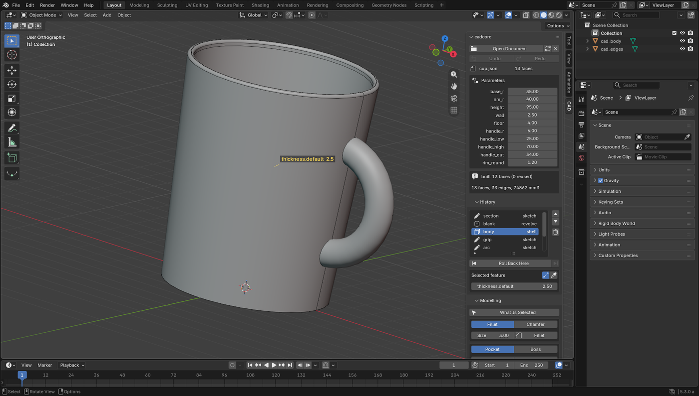
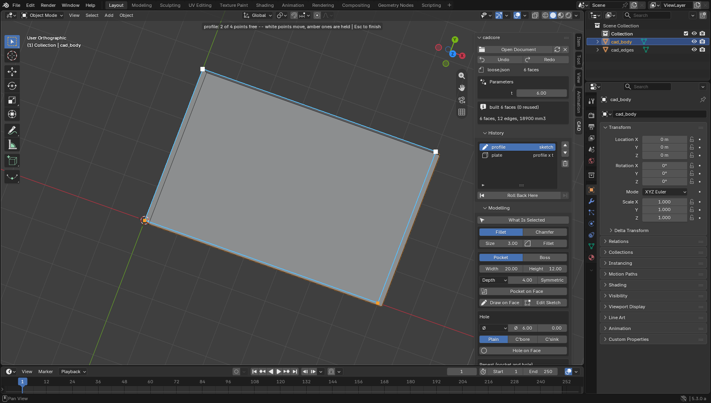
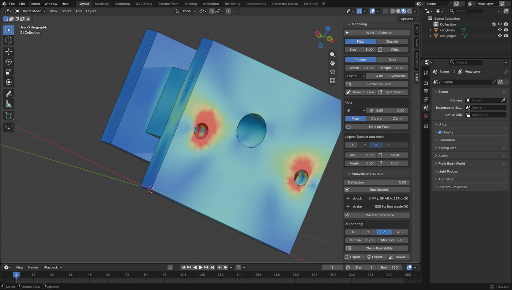
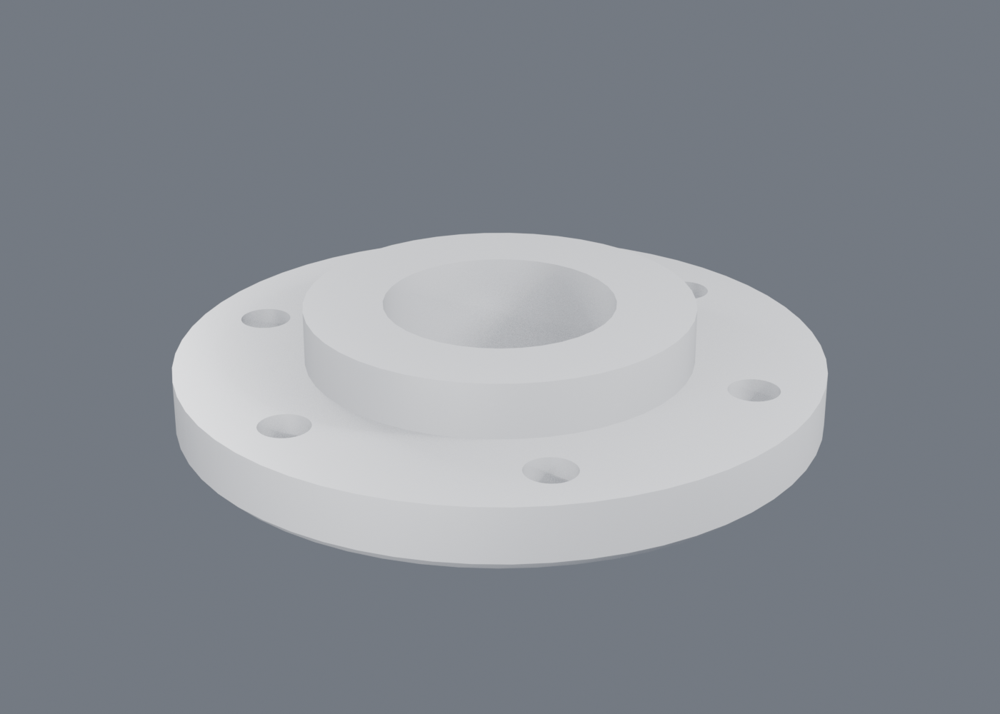

# The Blender add-on

## Finding an action

The RealParts sidebar keeps Create, Modify, Assemble, Inspect and Export
visible. Selection Actions offers tools for the picked face or edge. Choose
Drill a Hole, Cut a Pocket or Push / Pull before selecting a face to be guided
to a planar face; Esc cancels. With a face already picked, settings open directly.
The right-click menu still offers direct dragging.

A flat face's menu also has Split Here (a cut dragged into the part), Emboss
Text (words raised off or cut into the face) and Draft From Here (the walls
lean away from the face's plane, degrees by a drag); a round face has Wrap
Text Round It and Coil Round It (the pitch by a drag); two faces have
Distance Between. Inspect has Check Moulding (Draft), which paints the
walls that need draft and the undercuts, and Mass. The Parameters panel
holds the part's material and colour.

Edit Feature shows the feature just created or edited. Change its values to
rebuild; expand All settings for the remaining arguments. History and document
Parameters are below it. Export is reachable without opening Design Checks.

Create / Edit with AI shows the current selection sent with the request. Its
result can be adjusted in Edit Feature and undone one edit at a time. External
assistant connection settings are available from the checkbox in that panel.

Verify the UI with `blender -b --factory-startup -P tools/verify/verify_ui.py`,
in addition to `verify_addon.py` and `soak_addon.py`.

[← README](../README.md)

## The add-on: editing from the viewport

Importing CAD into Blender is a solved problem. The return trip is not, and that
is what `blender_addon/` is for.

```bash
python tools/package.py build   # build/cadcore_bridge.zip, about 1 MB
# install it in Blender and press Install the CAD kernel in the add-on's
# preferences -- no separate Python, and no path to set: the kernel's code,
# the examples and the manual are inside the zip
```



The sidebar is the document: named parameters that rebuild on edit, the feature
history with what each feature did, and the model's own numbers drawn beside the
geometry they control. Nothing here is a mesh modifier -- every row is a BREP
feature the kernel rebuilt. The cup is `examples/cup.json`: a revolved section,
shelled with a heavier floor than wall, a handle swept along an arc and fused,
and a fillet on the rim -- 13 faces, and the wall thickness above is one number.

* **Draw on Face** — draw a profile straight onto a selected face. Near-axis
  segments become horizontal and vertical constraints; lengths become *named
  dimensions*, added one at a time and only while the sketch still has freedom
  left. A roughly drawn rectangle comes back as two dimensions and four
  constraints, fully determined, and the panel can drive them afterwards.
* **Move Part, Cut/Fuse by Pick** — in an assembly, grab a face of a part and
  drag the part (its `translate` follows; X/Y/Z locks an axis; a part placed by
  a mate says so and names the mate instead), and click one part then another
  to cut, fuse or intersect them -- the assembly is re-pointed at the result.
* **Mate, Drive, Take Apart** — pick two faces of two parts and Mate holds
  them together, solved with the assembly's other mates: flat faces flush,
  round faces on one axis, or any of the thirteen kinds from the redo panel.
  Drive grabs a part by a picked face and drags it along what its mates leave
  free (S switches turn to slide); the other parts follow, Enter writes the
  position into the document, Esc puts it back. Take Apart shows the exploded
  view; only the picture moves, and 0 puts it back.
* **Press/Pull, Box Cut/Boss, Hole Here, Drag Fillet, Plane Off Face** — the
  hands-on five. Only two of them are tools in the toolbar (T): the pen and
  the hole, the two that place many things in a row. The rest are reached by
  grabbing what the pick draws on the part -- the arrow, the two edge grips,
  the pencil, the plane mark -- because choosing a tool before doing a thing
  is a mode by another name. Drag a rectangle on
  a face and then drag the depth -- in for a pocket, out for a boss; drag a
  work plane off a face and draw on it. Typing a number during any drag
  states the value the drag was finding, in a badge beside the cursor as well
  as in the header. A drag past what the shape can take leaves the last size
  that built on the screen and turns the badge red: letting go keeps what is
  shown, rather than opening a box to say no. Select a face and drag it in or out and
  the model follows; click a face where the holes go, wheel through M3..M12;
  select edges and drag the radius. The preview is the kernel rebuilding the
  real document with the value under the cursor, coalesced so forty mouse
  moves are a few rebuilds; letting go is one undoable step, because the
  kernel treats the drag as a run of trials (`begin_drag` … `end_drag`) that
  it records as one step, or none. Nothing counts undo steps: a drag of any
  length lands one back exactly where it began. Each also runs without a mouse (`press_pull(distance=3)`),
  which is how the headless verification presses them.
* **Pocket / Boss / Hole / Shell / Draft / Fillet / Chamfer** — face and edge
  picks, answered in CAD terms: two picked faces mean the edges between them, one
  face means its border, and the wire object gives exact edge picks.
* **Dimensions on the model** — the selected feature's numbers float beside the
  geometry they control, and clicking one types over it. A number in a sidebar is
  a form field; the same number beside its face is a drawing.
* **Work planes are made where you are about to draw, and hand you the pen.**
  Off a face (drag the plane mark beside the pencil), halfway between two
  parallel faces (right-click), or hung on a straight edge and turned about it
  on a ring (right-click). All three finish with the pen on the new plane, so
  the plane is never something to go and find again. An angled plane is stored
  as the face, the edge and the angle rather than as three vectors, so it
  keeps touching the part when the face moves; the angle is a parameter. A
  sketch drawn on an existing face makes no work plane at all -- it is held by
  the face's own name.
* **The sketch, on the part** -- pick a face and the feature that made it is
  selected; if a sketch made it, that sketch is drawn where it lies. (A face
  carries the id of the feature that made it, the feature says which sketch it
  swept, and `sketch_of` answers with it, so no map is kept on this side.) Its
  points and lines are then picked with the same tool as a face: click a point,
  drag it to move it, shift-click to add a second. There is no sketch mode to
  enter or to leave, and the overlay writes where every point and line landed
  in region pixels so that the pick tool can click exactly what is on screen.
* **Right-click on the sketch: only the holds that fit.** One line can be kept
  level or upright; two lines parallel, square, the same length, touching, or
  at the angle they are; one point pinned where it is; two points put together
  or held a distance apart. A pick that fits nothing is told what to pick
  instead rather than shown ten buttons that would refuse. A distance and an
  angle are both dimensioned at what you drew rather than snapping the sketch
  the moment they are added -- and the angle is read off in the same sense the
  solver will read it, so the shape does not flip to the supplement.
* **The sketch panel** lists every constraint with what it holds, a field for the
  ones that carry a number, and an X to take it off -- and says whether the sketch
  is fully constrained or how many degrees of freedom are left.
* **Dragging a sketch point** moves whatever the constraints leave free, and
  nothing else. On a fully constrained sketch that is *nothing* -- so the reply
  names the constraints holding the point and the parameters that would move it,
  which is more use than a silent refusal. Dragging never rewrites a dimension
  behind your back. The overlay says which points those are *before* you pull on
  one: white dots move, amber dots are held. Each answer is a probe solve of the
  sketch alone -- nudge the point, re-solve, and see whether it lands back where
  it started -- so the colours come from the same solver the drag will use.

  
* **History** — move a feature (which in a graph means re-linking the chain), roll
  the model back to any point, edit a feature's numbers in place, and undo.
  Ctrl+Z is Blender's own, and always was: the modelling operators register an
  undo step like any other operator, and `state.on_undo` walks the kernel to
  wherever Blender lands. That is also what makes F9 work. The add-on binds no
  keys of its own -- an earlier version took the key over on the CAD body and
  answered from the kernel's own history, which is two undo stacks in one
  editor, and `blender_addon/__init__.py` says why it does not any more.


* **Run Studies** — the solved field is sampled at the tessellation's vertices and
  summarised per CAD face, so the colours land on the faces you select from. Pick
  a face afterwards and the panel reports its peak stress by name. The scale is
  the 95th percentile, not the peak: a singular corner would otherwise wash the
  whole part blue.
* **Thread on Face / Erase Faces / Open Faces / Thicken / Close Surface** — the
  surface and direct-editing tools, driven by face picks: thread a bore, take a
  fillet off an imported solid, open a face to work on the shape as a surface,
  and close it again.
* **Drawing / Check Interference / Export STEP** — the same tools as the CLI.

The kernel runs in its own process (`python -m cadcore.service.server`, one JSON object
per line) for one reason, and it is worth naming exactly which: **an OCCT
boolean that crashes takes its process with it**, and that process should not
be the one holding the user's unsaved work.

It is not that OpenCASCADE cannot load into Blender's interpreter. It can:
Blender 5.3 ships Python 3.13, `cadquery-ocp` and `planegcs` both publish
wheels for it, and measured there OCCT builds the same solids to the same
volume. Nor is it the licence — OCCT is LGPL with an exception and this is
BSD, and both are GPL-compatible. Both of those were given as reasons here
before, and both were wrong. Refusals cross it as data:
deleting a sketch an extrude still consumes comes back as `feature_in_use` with
the dependents listed, and the document is left exactly as it was. If the kernel
is missing, the add-on's preferences offer to install it: the wheels for
**Blender's own Python**, either the kernel alone (~85 MB: modelling,
sketches, drawings, sheet metal, export) or the kernel with the studies
(~160 MB, adds `simulate` and `optimize`). Installed from the zip, they go
under Blender's per-user config, where an add-on upgrade does not delete
them; from a checkout, into `.kernel/cp313` beside it. No other Python has
to be on the machine. The add-on used to go looking for a
`python3.13` on the PATH and build a virtualenv with it, which on a developer's
machine is fine and on the machine of somebody who installed a Blender add-on
is the first thing that fails. Blender ships the interpreter, every wheel the
kernel pins is published for it, and `sys.executable` names it; the kernel
process is that binary with the installed directory first on its path. A
developer's `.venv` beside the repository is still used when there is one, and
*Kernel Python* in the preferences overrides both.

The whole loop is checked without a window, twice: from the checkout, and
from the zip a buyer gets, installed into a Blender that has never seen it:

```bash
blender -b -noaudio --factory-startup -P tools/verify/verify_addon.py
BLENDER_USER_SCRIPTS=/tmp/fresh/scripts BLENDER_USER_CONFIG=/tmp/fresh/config \
  CADCORE_KERNEL_PREFIX=.kernel/cp313 \
  blender -b -noaudio --factory-startup -P tools/verify/verify_retail.py
```

The second one exists because the first could not show what the first buyer
on a Japanese Windows saw: the sheet export dying on a diameter sign the
locale's encoding could not write.

    VERIFY selection -> edge names       ok ['plate/left|plate/top']
    VERIFY pocket follows its face       ok built 16 faces
    VERIFY every instance is named       ok ['pocket1/floor', 'pocket1/floor~1', 'pocket1/floor~2']
    VERIFY editing an argument rebuilds  ok 14292 -> 13676 mm3 (bore 6 -> 9)
    VERIFY stress is reported per CAD face  ok h2/side at 50.1 MPa
    VERIFY interference check            ok 2 parts, no interference
    VERIFY RESULT all ok

## Looking at it

A panel is written blind. `layout.row().prop(...)` says nothing about what it
comes out looking like, and the only way to see it was to open Blender and
scroll — so nobody did, and the sidebar drifted into a wall of unlabelled
fields.

```
blender --window-geometry 0 0 1400 2000 -P tools/render/shoot_panel.py -- build/ui
```

opens a real window on a real display, takes a real screenshot of the sidebar
at the width a person actually has (280 pixels), and does it twice — with
nothing picked and with two faces picked, because half the design is what
changes between them.

It found things a mock-up cannot. `Pocket — select 1 face` reads well in a
wide sketch and is `Draw — sele...` in the sidebar; three fields on one aligned
row lose their labels, so a hole's depth was a lone `0.00`; and the same
refusal appeared on four buttons at once. All three were invisible until there
was a picture.

## The panel answers to what is picked

It used to look the same whatever was selected. A fillet with nothing picked
was a button that looked ready and was not; you found out by pressing it. Every
tool's precondition — a fillet wants edges, a pocket wants exactly one face, a
draft wants the faces to taper *and* the neutral one — was discoverable only
from the refusal.

Each operator had always *declared* what it needs (`wants` and `picks`, which
`EditFromSelection` uses to refuse a bad selection). Nothing read that
declaration to draw with. Now the panel does, so the button and the refusal are
the same fact and cannot drift apart:

    ▣ 2 faces · plate/+z, plate/+x
      [Round]  r 3.0
      Pocket  --  select 1 face          (greyed)
      Draft   --  select 2 or more faces (greyed)

Everything on that path is called from `draw()`, which Blender runs on every
mouse move over the panel, so what it costs is the whole design. Measured on
`bracket.json`: counting is 0.040 ms, naming is 0.077 ms, asking whether a tool
can run is 0.001 ms.

Counting is free because it does not walk anything in Python. In edit mode
`total_face_sel` is a live count off the BMesh; in object mode that reads zero
however much is selected — it is an edit-mode statistic — so the flags come
back through `foreach_get`, which is a C loop. Naming is not free and in edit
mode is not even *available*: a selection does not reach mesh data until it is
flushed, and flushing means toggling modes, which is not a thing to do while
drawing a panel. So names appear when they can be had honestly and the count,
which is what decides whether a tool can run, is always right.

**A selection survives a rebuild.** It did not: editing a parameter replaced
every polygon and took whatever you had picked with them. The names are the one
thing that *does* survive a rebuild — it is what this whole project is about —
so the selection is carried across on them.

## Dragging a slider is one rebuild, not forty

A parameter's update callback fires on every tick of a drag, and each tick went
straight to the kernel. Measured, one tick costs **66 ms** end to end on
`bracket.json` — and 53 ms of that is the rebuild itself. The round trips
people assume are the problem are 2.2 ms of tessellation and 0.2 ms of
describing the document; eliminating them would take 66 ms to 62 ms.

So an edit is coalesced instead. The first change in a while goes through
immediately, because a single click on a slider's arrow should not feel
delayed; changes after that are held, and run when the drag has been quiet for
a moment or every quarter second, whichever comes first, so the shape follows
a drag at a few frames a second instead of queueing behind it. A forty-tick
drag went from **2640 ms to 131 ms**.

The last value always lands. Every other operation flushes what is held before
it runs, because a held edit is a change the *document* has not been told about
yet: a save would write the value the drag started from, an undo would undo the
wrong step, and an export would write a shape that is no longer on screen.
Being fast is not worth being wrong about what the model is.

That flush is also how the selection bug above was found. Holding the edit
moved the rebuild to *after* the click that picked the faces, so a fillet right
after a drag saw nothing selected.

## Saving, and the work a crash used to take

The kernel runs in its own process so that an OCCT boolean that segfaults
cannot take the editor down with it. That argument only holds if the *work*
survives too, and it did not: an edit made from the viewport lived in the
kernel's memory alone, the add-on had no Save at all — `op_save` was in the
kernel the whole time and no operator ever called it — and the client's answer
to a dead kernel was to start a fresh one and reopen the file, which is the
document as it was before the session began.

So there are two things now, and they are deliberately different:

**Autosave** is the kernel's, and it is not a save. Every successful edit is
written next to the document as it is made, under its own name
(`bracket.autosave.json`). The document itself is untouched until somebody
says otherwise, which is the whole point of a save. This is what makes a crash
cost the last operation instead of the afternoon.

**Save** is the operator, and it writes the document and drops the sidecar it
made obsolete. The button says whether there is anything to save — a Save that
always looks the same tells you nothing about whether you need it — and the
second button beside it is Save As.

Opening a document whose sidecar is *newer* than it finds work nobody saved.
The reply says so and does nothing about it: which of the two the user wants is
not a thing to guess, and a recovery nobody was offered is one nobody can
decline. The panel offers **Recover it**, which opens the sidecar's content
while keeping the document's own path, so saving afterwards puts the work where
it was always going. Newer, not merely present: a sidecar left behind by a
session that *did* save is not unsaved work, and offering to recover from one
would train people to dismiss the only message here that ever matters.

Restarting the kernel recovers, and so does the client after a crash. Both are
the same situation — restarting the *kernel* is not abandoning the edits.

## Parameters Blender can animate

A parameter always had a field in the sidebar. What it did not have was a home
Blender understands: a driver cannot point at a collection on the scene, and a
keyframe on one is not something anybody finds again. So the document's
parameters are mirrored onto the `cad_body` object as ID properties, which is
where Blender gives a made-up number a slider, a keyframe, a driver target and
a place in the saved file.

The range comes from the document. `parameters_bounds` is already the envelope
the fuzz test samples inside, so it is the right range for a slider too; a
parameter that declares none gets a soft range around its value rather than a
hard one, because a limit nobody wrote down is not a limit.

**Rebuild on frame change is off by default, and that is the design rather
than caution.** These are the numbers:

| | per frame | |
|---|---|---|
| rigid motion | a transform | real time |
| a link rebuilding | 20-80 ms | plays, just |
| a gear rebuilding | seconds | bake it |

Leaving it on while scrubbing a scene that happens to contain a CAD body would
stall the timeline for work nobody asked for. Turned on deliberately, a
dimension is animatable: keyframe `centres` on `cad_body` in the N panel and
the solid follows.

There is no IPC cost worth avoiding here, which was worth measuring rather
than assuming. Over the pipe a `face_frame` is 0.06 ms against 0.01 in-process
and a `tessellate` is *faster* over the pipe than in-process, because the
child caches it. Moving reads into Blender's interpreter to save that would
buy a tenth of a millisecond and cost the crash isolation that is the whole
reason the child exists.

## Rendering




```bash
blender -b -noaudio --factory-startup -P tools/render/render_part.py \
    -- examples/flange.json build/flange.png            # clay
blender -b -noaudio --factory-startup -P tools/render/render_part.py \
    -- examples/bracket.json build/stress.png stress    # coloured by the field
python3 tools/render/legend.py build/stress.png <scale> <peak> "<title>"
```
