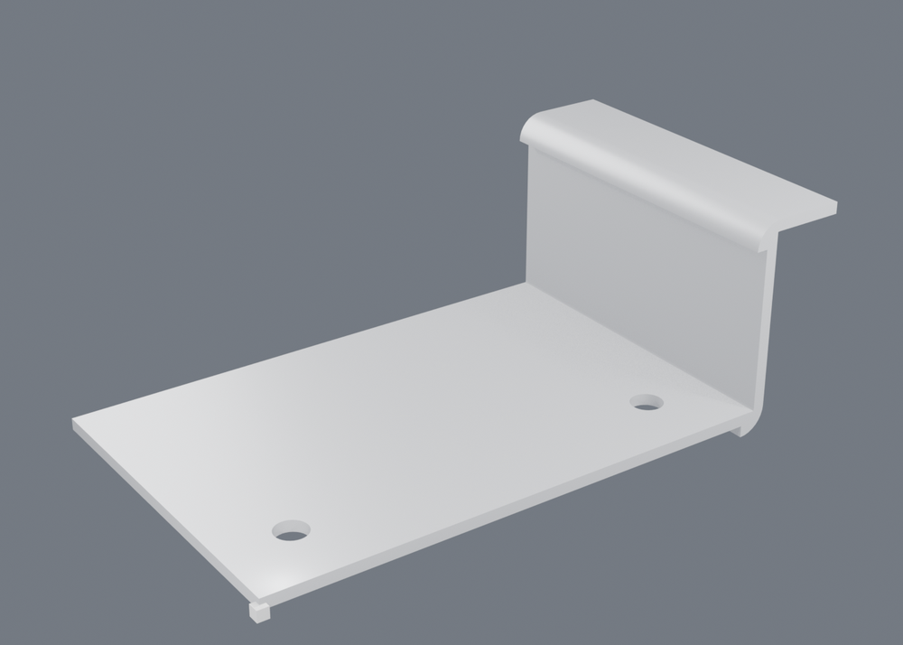
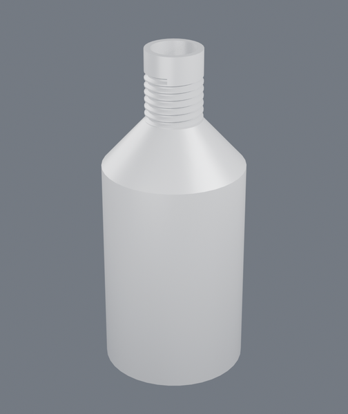
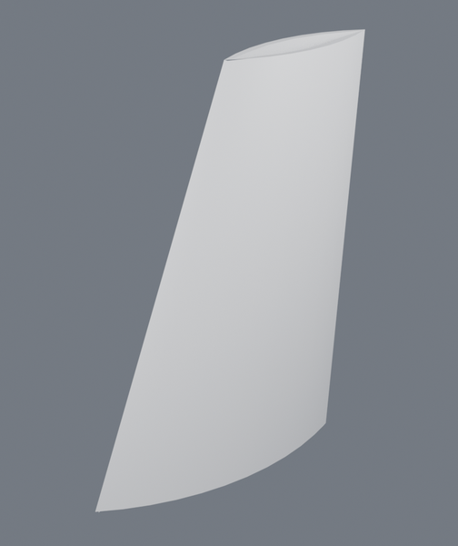

# Features

[← README](../README.md)

| | |
|---|---|
| solids | `box`, `cylinder`, `extrude`, `revolve`, `loft`, `sweep` (along a path sketch or a `helix`), `rib` |
| booleans | `cut`, `fuse`, `common` (`glue`, `fuzzy`), `pocket`, `boss`, `hole`, `split` (at a plane or a surface, keep a side or both), `emboss` (a sketch raised off or cut into any face, projected or wrapped round a cylinder) |
| edges | `fillet` (constant or `[start, end]` variable), `chamfer` |
| copies | `translate`, `mirror`, `pattern` (linear, circular, or along a path) |
| datums | `plane` (offset from a face, or between two), `axis` (a bore's, or explicit) |
| faces | `shell` (one thickness, or a heavier wall by name), `draft` (about a neutral face, or away from a `parting` plane) |
| input | `sketch` (lines, arcs, circles, ellipses, splines, slots, `texts`, an `outline_offset`, a DXF or SVG `file`), `import_step`, `import_iges` (both with `heal`; a STEP's colours and materials come too), `import_brep`, `import_mesh` (STL, OBJ, 3MF, glTF) |
| surfaces | `surface` (planar, skin, extrude, revolve, sweep, `points` through a grid, `boundary` between two to four curves), `fill`, `sew`, `thicken`, `cap`, `offset_surface`, `trim`, `extend`, `delete_face` |
| threads | `thread`, or `"threaded": true` on a hole |
| sheet metal | `sheet` (a blank with a thickness it remembers), `flange` (bend a flap at an edge) |
| direct editing | `move_face` (push or pull one face), `delete_face` (healed, or left open) |
| assembly | `part` (another document, a sub-assembly included), `fastener` (a standard screw, bolt, nut or washer), `mate` (one transform, in order), `assemble` (with `mates` solved together and a `drive` list) |
| mate kinds | `fastened`, `planar`, `concentric`, `parallel`, `perpendicular`, `angle`, `distance`, `tangent`, `hinge`, `slider`, `ball`, `gear`, `screw`, `belt`, `slot`, `cam`; a hinge or slider takes `min` and `max` -- see [output.md](output.md#the-mate-kinds) |

**How far a feature goes can be a relationship rather than a number.** A pocket
or an extrude takes `"until": "through_all"`, `"next"`, `{"face": "..."}` or
`{"plane": "..."}`, and `"symmetric": true` to straddle its sketch. "To next" is
answered by asking the geometry -- a ray from the profile, taking the first face
it genuinely crosses -- so it re-answers itself when the part changes. That is
the difference between a model that survives an edit and one that was right once.
A face or plane to stop at has to lie square to the sketch: a sweep ends flat,
and one that is tilted is refused as `nothing_to_stop_at`. A rib measures its
`until` along its own direction, from its profile.

**Sheet metal is a part that has to be makeable.** The difference between it and
a solid that happens to be thin is the blank: cut from flat stock, bent on a
brake, and the flat has to be right or the part comes off the machine the wrong
size. So a bend is a *feature* -- it records the edge, the angle, the inside
radius and the length -- and the flat pattern is computed from those numbers
rather than by unfolding the solid afterwards:

    developed length = A * (R + K * T)

with `K` the neutral-axis factor (0.44 for the mild steel and aluminium a brake
usually sees). That is the part no amount of looking at the geometry can
recover, because it depends on how the material stretched.



```
$ python -m cadcore unfold examples/sheet_bracket.json
flat pattern: 2.00 mm thick, 2 bend(s) adding 52.62 mm to the blank
  bend  edge                              angle   radius  allowance
  wall  plate/right|plate/top             90.0    2.50     5.309
  lip   wall/end|wall/face               -90.0    2.50     5.309
```

The thickness is measured off the sheet rather than asked for -- a flange built
at a thickness the part does not have would not be sheet metal any more -- and
the flap's faces are named for their part in the bend (`wall/bend`, `wall/face`,
`wall/end`) because `+x` is true and useless when the next bend is at the *end*
of this one. The bends survive the features that come after them: a boolean
carries a body's record of itself, so drilling the holes does not make the flat
pattern uncomputable.

**Direct editing** is `move_face` and `delete_face`. Pushing a face moves it
along its own normal and the walls it slides along keep their names -- the
coplanar pieces a boolean leaves behind are welded, so the part does not grow a
seam. Deleting one either heals the wound (OCCT defeaturing: how an imported
STEP loses a fillet it should not have had) or leaves it open for surface work.

**Not everything is a solid.** A surface is an ordinary feature -- named, cached,
editable -- and the operations that matter are the ones that get back to a
solid. Delete a face and the shape opens; ``fill`` patches a boundary with a
surface built to meet its neighbours tangentially (`G1`) or with matching
curvature (`G2`), and reports how closely it actually managed it; ``sew``
stitches the pieces and makes a solid if the result closes; ``thicken`` gives a
skin a wall. An open shape's *boundary* edges are named too -- ``skin/side|open``
-- because they are what the next operation refers to. Anything that needs a
closed solid (mass, printability, a finite element mesh) refuses an open one by
name and says which way out to take.

Deleting a face can also *heal*: OCCT's defeaturing grows the neighbours back
together, which is how an imported STEP with no history gets a fillet or a boss
taken off it.

Holes can be asked for by name -- `{"standard": "M6", "fit": "tapped"}`, or
`"fit": "normal", "seat": "counterbore"` -- and the ISO numbers come from a
table, with the note that belongs on the drawing.

**Threads are geometry when they need to be.** For a machined part the note is
the thread and the model stays a cylinder. For a printed one the helix has to be
there or it does not exist, so ``"threaded": true`` on a hole -- or a ``thread``
feature on any cylindrical face -- cuts the real ISO profile. Which way the
groove goes is read off the face rather than asked for: OCCT builds a cylinder
with its normal pointing away from the axis, so the inside of a hole is the
reversed one, and a hole threads outward while a shaft threads inward.
``clearance`` shrinks the cut all round, which is what makes a printed pair
actually screw together.

    $ python -m cadcore build examples/bottle.json          # revolved, shelled, threaded neck
    built examples/bottle.json: 37 faces, 182 edges, volume 58730.2 mm^3

    $ python -m cadcore build examples/fairing.json         # an aerofoil skin, thickened
    built examples/fairing.json: 8 faces, 16 edges, volume 17939.0 mm^3

<p>
  
  
</p>

Cutting a helix is a study in how OCCT fails: every one of these finishes,
reports success, and hands back the wrong solid.

* A helical face lying **on** the cylinder it cuts is a tangential boolean, and
  the answer comes back empty -- or with the whole part removed. So the thread
  is not cut as a groove at all. The depth is turned off the cylinder first (a
  plain ring, an ordinary boolean) and the thread is added back as a *ridge*
  that overlaps the turned-down core rather than touching it.
* The ridge's crest stops two hundredths of a millimetre short of the nominal
  radius. At exactly that radius it lies on the same surface as the plain collar
  above the thread, and coincident surfaces are the case the algorithm gets
  wrong: the fuse finishes and adds nothing.
* A swept solid's orientation is not guaranteed. The same profile swept at one
  radius comes out solid and at another comes out inverted, and an inverted tool
  makes the fuse *remove* material. The solid is rebuilt from its shell by the
  fixer that orients from the sign of the volume, then checked against a point
  that cannot be inside a thread.
* ISO truncates the crest to a flat of `p/8`, which on an M6 is a tenth of a
  millimetre -- below the swept surface's own fitting tolerance. The flat has a
  floor, which is also the right shape for a printed thread.

And the answer is checked rather than assumed: a thread of a given size adds a
known volume -- a trapezoid dragged along a helix is arithmetic -- so a fuse
that added something else is a `thread_failed` carrying the numbers, rather than
a part with a thread-shaped dent in it.

Every feature carries names across. A `hole` is one feature including its
counterbore or countersink, and it can repeat itself, so a bolt circle is one
line in the document rather than six. An imported STEP has no history to inherit
from, so its faces are named from their own geometry — planes by their axis,
cylinders as sides, the rest ordered by position — which is deterministic for a
given file and enough to keep modelling on.

## Units

A document says what its numbers are in, and the default is millimetres:

```json
{"unit": "in", "parameters": {"lean": 30, "run": 4},
 "parameter_units": {"lean": "angle"}}
```

`mm`, `cm`, `m`, `in`, `ft` — deliberately few, and every one of them exactly
some number of millimetres, so nothing rounds between what somebody typed and
what gets built.

**The kernel is millimetres and stays millimetres.** OCCT's tolerances are
absolute: the same model built in inches would be solved a thousand times
coarser than one built in metres. So a unit belongs to the *document*,
converted once on the way in and reported on the way out, and never to the
geometry.

The conversion is not done in the expression evaluator, which is where it
would first occur to anyone to put it — every number a feature reads passes
through there, and it would multiply a revolve's `360` and a pattern's count
of `3` as happily as it multiplies a radius. That is the version of unit
support that is worse than having none. Instead each argument says what it
measures:

| | |
|---|---|
| `Number` | a length, because in a CAD document nearly everything is |
| `Angle` | degrees, whatever the drawing is dimensioned in |
| `Count` | how many, which is not a size |
| `Point` | a place — converted |
| `Direction` | which way, not how far — not converted |

A parameter has no such declaration of its own, so `parameter_units` gives it
one. Leaving it out is safe: a parameter used as an angle while counting as a
length is **refused by name**, with the fix in the message, because that is the
one mistake this cannot survive quietly — `lean = 30` becoming 762 builds a
different part without a word.

```
parameter_unit_unknown: this document is in 'in', and lean is used as an
angle while counting as a length
  hint: say what it is: "parameter_units": {"lean": "angle"}
```

A millimetre document is not touched at all, which is nearly every document
there is.

## Requirements

What the part must be, written in the document and measured on every build:

```json
"requirements": [
  {"id": "light",  "quantity": "mass_g",    "compare": "<=", "value": 150},
  {"id": "fits",   "quantity": "bbox_max",  "compare": "<=", "value": "width + 5"},
  {"id": "prints", "quantity": "printable", "compare": "==", "value": 1, "min_wall": 1.5},
  {"id": "one",    "quantity": "solid",     "compare": "==", "value": 1}
]
```

`asserts` guard the parameters and a study's `require` guards a solve. A
requirement is the thing a designer says first -- under 150 grams, fits the
box, prints, one solid -- and it is a fact about the built shape, cheap to
ask. Every build reply carries `requirements` with `got` and `ok` per row, so
the sidebar and an assistant are told the moment an edit breaks one. It is
status, not a gate: a part half-made is allowed to be too heavy, and the edit
goes through. `value` may be an expression over the parameters, so a bound can
move with the design.

Quantities: `volume_mm3`, `area_mm2`, `mass_g` (density from the
requirement's `material`, else `meta.material`, else A6061), `faces`,
`bbox_x/y/z`, `bbox_max`, `bbox_min`, `solid`, `printable` (`min_wall`,
`overhang`). An unknown one is refused with the list; `requirement_kinds`
returns the same list, and the Blender panel's dropdown is built from it.

Strength stays in the study's `require`, because it needs a solve.
`requirements()` shows both, and marks the study rows *stale* once the
document has changed since `simulate` ran -- a safety factor computed for a
different part is not a fact about this one.

## Switching a feature off

```json
{"id": "rounded", "type": "fillet", "body": "plate", "radius": "r",
 "suppressed": true}
```

A parameter moves, a fillet stops converging, and until now the only way
forward was to delete it — which loses the arguments, loses its place in the
history, and records *the designer giving up* rather than the model changing.
Suppressed, the feature stays in the document with everything it had and hands
its input straight through, so the rest of the chain still builds and it is one
click from coming back.

Which input it hands through is **declared**, not guessed: a cut is its target
with a hole in it and not its tool, and both of those are references, so no
rule about argument kinds can tell them apart. `stands_for` on the feature type
answers it once, for suppressing and for the re-linking that deleting a feature
already did — where it had been a hand-written `body or target` that happened
to be right.

A feature that makes a body out of nothing has nothing to hand through, and
says so:

```
cannot_suppress: 'b' is a box -- there is nothing for it to hand through
  hint: a feature that makes a body out of nothing can be removed but not
        switched off
```

In the viewport it is the checkbox beside the bin, which is where it belongs:
it is what somebody reaches for the bin to do.

## Repairing a reference

```
python -m cadcore repair part.json
built as far as welded
  r.face                       plate/+z               split
      could be: plate/+z@0, plate/+z@1

python -m cadcore repair part.json "plate/+z" --to "plate/+z@1" --save
```

`dropped` has always been in the build reply, so "which names died" was
answerable. What was not was *so what do I do*: the only tool was rewriting the
whole feature's arguments and hoping nothing else moved. In a project whose
claim is that references survive, a reference that did not had no repair.

It does not need a working build, which is the point — the question comes up
because the build failed. The chain is walked back from the end until something
stands up, and the rest is checked against that; the content-hash cache makes
that nearly free, because every step but the last is already in it.

Two things go wrong and they want different answers:

| | | |
|---|---|---|
| `missing` | the face is gone | point it somewhere else |
| `split` | a boolean cut the face in two | say which piece |

A split name still *resolves*, through an alias, to one arbitrary piece — so it
works for finding the face again and not for measuring from it, which is the
`face_was_split` refusal. The candidates come from the naming vocabulary rather
than from guesswork: same feature, same role, differently numbered, which is
exactly what a split (`@k`) or a pattern (`~k`) leaves behind.

The rewrite reaches names wherever they are nested — inside an edge query,
inside an end condition, inside a list — because which arguments name geometry
is declared, and a *feature* reference that looks identical is left alone.

## Sketches

A sketch is points, segments and constraints, solved with PlaneGCS. **Segments
carry names, and the sweep passes those names to the faces it generates** —
`plate/chamfer` is the face made by the segment the designer called `chamfer`,
whatever the dimensions do afterwards.

```json
{"id": "profile", "type": "sketch",
 "on": {"body": "plate", "face": "plate/+z"},
 "points":  {"o": [0,0], "a": [90,0], "b": [90,42], "c": [72,60], "d": [0,60], "m": [66,54]},
 "lines":   {"front": ["o","a"], "right": ["a","b"], "back": ["c","d"], "left": ["d","o"]},
 "arcs":    {"corner": {"centre": "m", "from": "b", "to": "c", "radius": "R"}},
 "circles": {"hole": {"centre": "h", "radius": "hole_r"}},
 "constraints": [
   {"type": "fix", "point": "o", "at": [0, 0]},
   {"type": "horizontal", "line": "front"},
   {"type": "tangent", "line": "right", "arc": "corner"},
   {"type": "distance", "points": ["o","a"], "value": "width"}
 ]}
```

A sketch may hold more than one closed loop: the largest is the outline and the
rest are holes. Placed `on` a face it follows that face, so widening the plate
moves the pocket that was drawn on it. Constraints: `fix`, `horizontal`,
`vertical`, `parallel`, `perpendicular`, `equal_length`, `coincident`,
`point_on_line`, `distance`, `distance_to_line`, `angle`, `radius`, `diameter`,
`tangent`, `point_on_curve`, `equal_radius`, `midpoint`, `symmetric`,
`on_perpendicular_bisector`.

An **angle** is in degrees, because every other angle in a document is -- a
revolve's 360, a flange's 90. It is signed, and read *from the first line to
the second*, where a line's direction is the order its endpoints were written
in. Naming the two the other way round gives the negative, and redrawing a
segment end-for-end turns an angle into its supplement:

```json
{"type": "angle", "lines": ["base", "slant"], "value": "lean * 2"}
{"type": "angle", "points": ["o", "b"], "value": 35}
```

The second form sets the direction of one segment rather than the angle
between two.

An **offset** is written as a relationship rather than a copied line -- parallel
at a distance, so moving the source moves it and the distance is a parameter:

```json
"offsets": {"north": {"of": "south", "distance": "wall", "side": "left"}}
```

A **projection** brings an existing edge into the sketch *as a reference*. The
geometry is pinned where the model puts it and re-projected on every rebuild, so
a counterbore whose centre is a bore's rim stays concentric when the bore moves
or changes size. An edge that is gone is refused rather than quietly redrawn:

```json
"projections": {"rim": {"edge": "plate/+z|tool/side"}},
"circles":     {"seat": {"centre": "rim_c", "radius": "bore + 3"}}
```

A **trim** cuts a line where another crosses it and keeps one side. The cut
point is *constrained* onto both lines rather than computed once, so it
re-answers itself when either line moves, and the kept piece is named the way
the 3D side names a face a boolean split -- `south@0` -- because it is the same
event:

```json
"trims": {"t1": {"of": "south", "at": "slant", "keep": "start"},
          "t2": {"of": "slant", "at": "south", "keep": "end"}}
```

A **slot** is written as what it is -- a centreline and a width -- and comes back
as four named segments (`slot/left`, `slot/start`, ...), tangent where they meet:

```json
"points": {"a": [0, 0], "b": [40, 0]},
"slots":  {"slot": {"from": "a", "to": "b", "width": "W"}}
```

**A sketch that can still move is refused** — but the solver's own count is not
trusted to decide that. PlaneGCS derives degrees of freedom from the rank of the
Jacobian at the solution, and the rank lies in a common case: a tangency that is
satisfied exactly reads as "redundant" and leaves phantom freedom on a sketch
that is in fact rigid. So when degrees of freedom are left over, the sketch is
solved a second time from a jittered start. Land in the same place and it was
determined; land somewhere else and the refusal names the points that moved.
Whether the constraints hold is likewise decided by their residuals, not by the
solver's status word.
