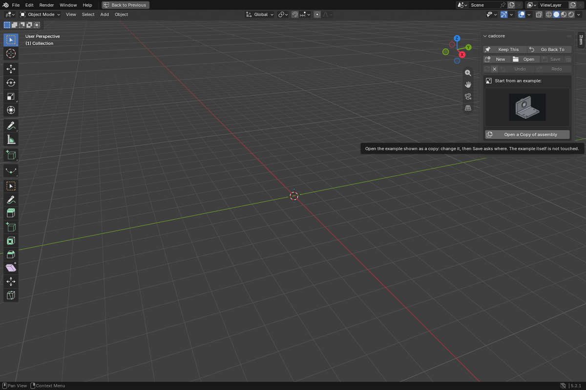
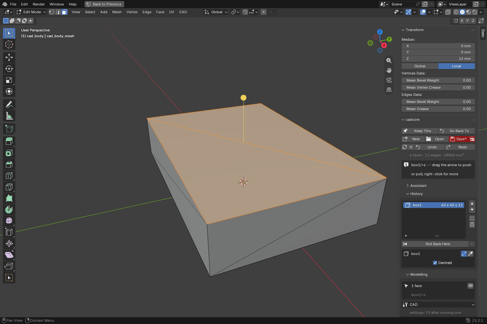
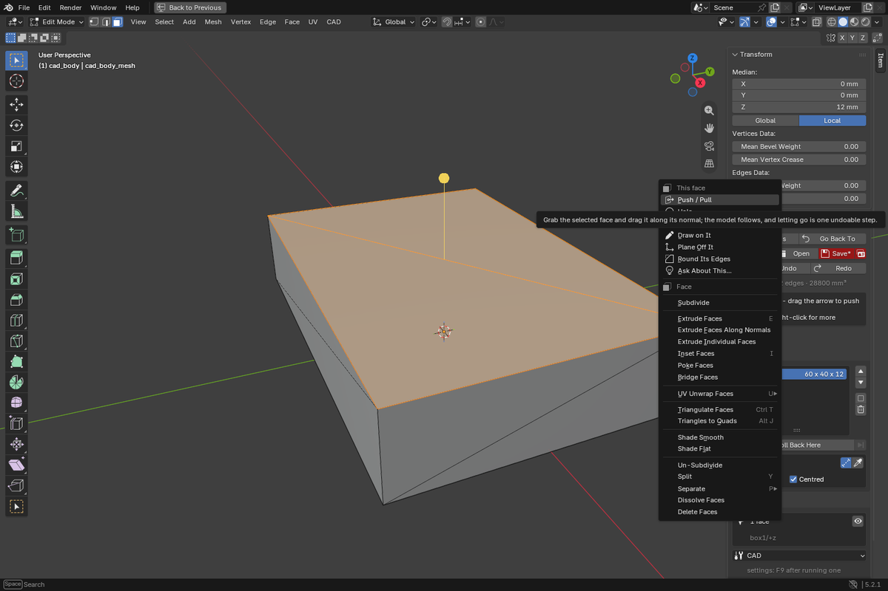
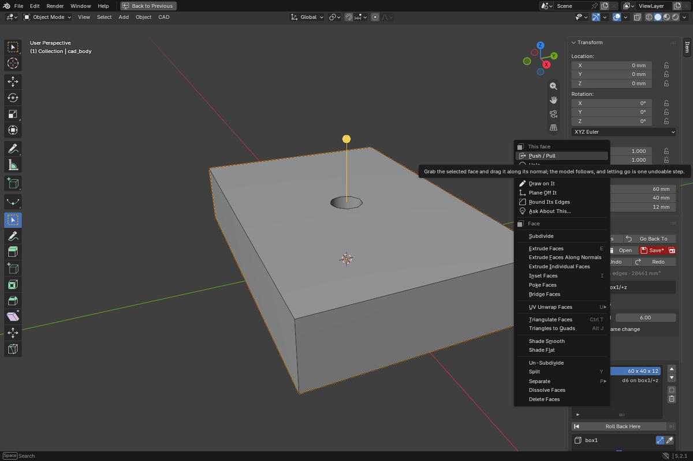
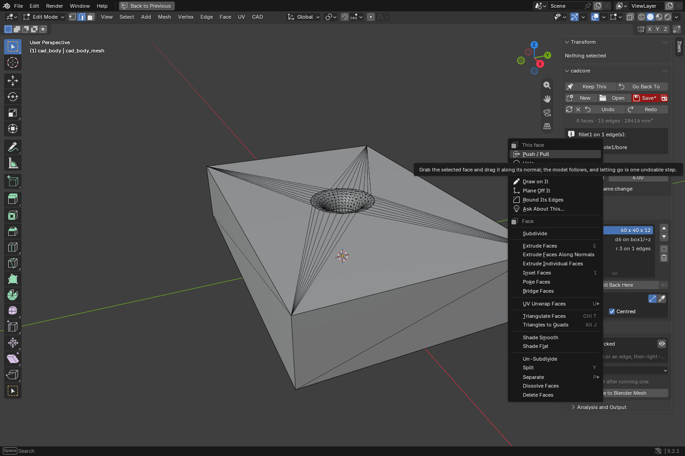
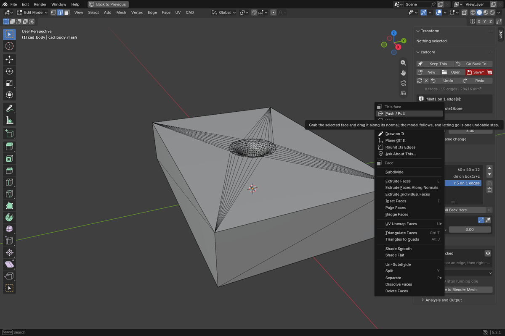

# How to use it

Ten minutes, one part. Pictures are in `docs/images/howto/`.

## 0. Set up, once

**Blender 5.1 or newer.** The kernel runs on Blender's own Python, which
became 3.13 in 5.1; on 4.x the Install button has nothing to install into.

Install the add-on zip (Edit > Preferences > Add-ons > Install) and open the
sidebar (`N`), then its **CAD** tab.

**The zip for your platform carries the kernel**, so there is nothing else to
set up. The small zip does not: it shows *Set up once*, and **Install the CAD
Kernel** fetches it (about 85 MB, or 160 MB with the studies, into Blender's
own Python; the status line follows the download).

For Ask, **Sign In** if Claude Code or Codex is installed, or paste an
Anthropic API key.

It goes into Blender's own per-user folder, not into the add-on, so
upgrading the add-on does not download it again. Nothing else has to be on
the machine: no separate Python, no compiler.

If it does not finish, the status line says which of the three it is. No
network reaches PyPI: a company proxy usually. Not enough disk: it needs
about 1.5 GB free while it unpacks. Wrong Blender: the line names the
version it found. The button is safe to press again -- what arrived already
is kept.

## 1. Start

Sidebar (`N`) → **CAD** tab → **New**. The panel offers the first solid:
**Box**, **Cylinder**, a rectangle or circle drawn on a ground plane and
extruded, or **Draw Your Own** -- a work plane and the pen, in one press.
Or pick an example from the pictures and open a copy of it.

## 2. Draw a shape

Two ways in, and neither asks you to set something up first.

**With no part yet.** The starter box has a fifth button, **Draw Your Own**.
It lays a work plane on the ground, picks it, and gives you the pen.

**On a part.** Pick the face and press the **pencil** that appears below it.
A curved face has no pencil -- a sketch needs somewhere flat. (The **CAD
Draw** tool does the same from a cold start: press the face you want to draw
on, and that press is what says which face.)

**In the air, parallel to a face.** Pick the face, drag the **plane** mark
next to the pencil, type the distance, let go -- and the pen is already on
the new plane.

**Halfway between two faces.** Pick two parallel faces and right-click:
**Draw Between These Faces** puts a work plane at the middle and hands you
the pen. Its offset from the middle is a number on the part, to retype.

**At an angle.** Pick a straight edge and right-click: **Turn a Plane About
It** hangs a work plane on that edge. Drag round the ring for the angle, or
type it; let go and the pen is on it. The plane keeps the edge, so it stays
touching the part however the face behind it moves, and the angle is a
number on the part like any other.

Drawing on a face makes no work plane at all: the sketch is held by the
face's own name, so it moves when the face does. A work plane is made only
when you are drawing somewhere the part has no face.

Then, with the pen going:

| | |
|---|---|
| click | place a point |
| click the first point | close the profile and finish |
| `C` | a circle: click the centre, then click for the radius |
| `Backspace` | take back the last point |
| `Enter` | finish an open profile |
| `Esc` | drop the whole thing |

The pen lands on things rather than near them. A corner of the face, the
centre of a hole through it, a point you have already placed, or level with
the last one: the cursor jumps and a green dot says it caught.

Draw roughly. What lands in the document is not where you clicked: a segment
within a few degrees of an axis becomes a **horizontal** or **vertical**
constraint, and lengths become **named dimensions**, added longest first and
only while the sketch still has any freedom left. A rectangle comes out with
two dimensions, not four that fight each other. If a drawing cannot be pinned
down that way it is refused rather than half-solved.

The profile is cut into the face 4 mm deep. Select the feature in the
**History** panel and two things are yours: the depth is a number on the part,
which you click and type over, and **Stand It Off** turns the cut into a boss.
The same profile and the same depth, the other side of the face; press it
again to cut it back in.

A sketch on a face is stored as the face's *name*, so the sketch moves with
the face: make the plate thicker and the profile is still on its top.

## 3. Click the part

The **CAD Pick** tool is in your hand as soon as there is a part, and it is
almost the only tool there is. The toolbar has three: Pick, and the two that
place many things in a row (the pen and the hole). Everything else is done by
grabbing what the part is showing you, or by right-clicking it.

| you point at | you do | you get |
|---|---|---|
| a face | click | the face is picked |
| its arrow | drag | push / pull |
| an edge | click | the edge is picked |
| the green disc | drag | round it |
| the orange cut corner | drag | take the corner off |
| the pencil | click | draw on that face |
| the plane | drag | a work offset plane, and the pen on it |
| a sketch point | drag | the point moves |
| a number | click | type over it |
| a part, in an assembly | drag | the part moves |
| a part, in an assembly | Assemble > Drive | drag turns it (S: slides) along what its mates leave; Enter keeps the position |
| two faces of two parts | Assemble > Mate | held together: flat flush, round on one axis, or pick the kind |
| anything picked | right-click | only what fits it |

Shift adds. You never change modes yourself.

**Before you click, the part tells you what you would get.** Whatever is under
the cursor lights up green: a face glows, an edge thickens, a corner or a
sketch point grows, a number gets a box, a handle gets a ring. When a corner
or an edge is in front of the face you actually wanted, **Tab** steps out to
the next thing under the same cursor; where there is nothing to step out to,
Tab is Blender's own key as before.

A picked flat face shows an arrow along its normal, and two smaller marks
below it: a **pencil** to draw on that face, and a **plane** to pull a work
offset plane. Both end with the pen in your hand, so you never go looking for
the plane you just made.

## 4. Right-click: what can be done to it

Right-click the pick. The top of the menu is only what fits: a face gets
Push / Pull, Hole, Pocket, Draw on It, Offset Plane, Round Its Edges; two
parallel faces get Draw Between These Faces; an edge gets Fillet and Chamfer;
a corner is named; a point or a line of a sketch gets the holds that fit it.
Ask About This... sends the pick to the assistant.

## 5. Push, pull, hole, round

Grab the arrow's tip and drag: the face moves and the part follows. The value
follows the cursor in a badge beside it -- not only in the header, where
nobody is looking. Type a number during the drag for an exact value. Enter
keeps, Esc drops. Every finished drag is one undo.

Drag further than the shape can take and the part does not disappear and no
error box opens: the part stays at the last size that built, and the badge
goes red and says why. Let go there and you keep what is on the screen.

Pick an edge and it carries two grips just off it, each with its word:
**Round** (a green disc) and **Chamfer** (an orange cut corner). Drag either
one -- or its word -- and the edge rounds, or the corner comes off. Rest
the cursor on a grip and the header says what a drag will do. Same number, typing, Enter and Esc. There is no setting to have left
the wrong way, and nothing to press twice: the two are both on the screen, so
you pick the one you want by looking at it.

Hole on a face, Fillet on an edge: pick, right-click, done. **Hole Here**
(CAD menu) drills where you click on the picked face, one hole per click
and one undo step per hole; the wheel sets the size and `Esc` ends it.
`F9` opens the
last operation's settings (size, standard, radius) to adjust.

Two more come off one pick, and only where they can work. Pick a **flat**
face and the menu offers **Mirror Across It**: that face is the mirror, and
the part is reflected through it. Pick a **round** face and it offers
**Pattern Around It**: the copies turn about that face's axis, evenly round
a full turn, `F9` for how many. Pick a face that is neither and neither
appears.

For a symmetry plane that is not a face, make one first: pick two faces,
**Offset Plane**, then mirror across the plane.

## 6. What holds the shape, drawn on it

Pick a face and the feature that made it is selected: its numbers appear on
the part, and if it came from a sketch, that sketch is drawn where it lies --
its lines, its points, and a mark for every hold on it.

| mark | what it says |
|---|---|
| `—` `\|` | this line stays horizontal, or vertical |
| `//` `⌐` | these two stay parallel, or square to each other |
| `=` | these two stay the same length |
| `~` | this line stays tangent to that curve |
| `×` | this point is pinned where it is |
| `•` `◎` | these points are together, or share a centre |

A white point can still move; an amber one is held. A distance is not a mark
-- it is the number itself, on the line it measures.

You work on the sketch there, with the tool already in your hand. **Click a
point and drag it** and the point moves, as far as the holds let it; let go
and that is one undo step. A point that cannot move says what holds it and
which number would move it, instead of quietly doing nothing.

**Right-click** and the menu offers only the holds that fit what is picked --
shift-click to pick a second point or a second line first:

| picked | offered |
|---|---|
| one line | Keep It Level, Keep It Upright |
| two lines | Parallel, Square, Same Length, Touching, Hold This Angle |
| one point | Pin It Where It Is |
| two points | Put Them Together, Hold This Distance |

A distance or an angle is taken at the size the sketch already is, so adding
one holds the shape rather than moving it; the number is then on the part to
type over. To take a hold off, the Sketch panel lists them with an X.

## 7. Numbers on the part

The numbers of the feature shown in the panel are drawn on the part,
beside what they measure. A drawn sketch's dimensions sit on their lines.
Click a number and type over it.

## 8. Ask

Write what you want in the Ask box, or press the pencil for a bigger
editor under the 3D view. The assistant already knows what is picked, what
the document is and what is built, so "M4 here" is enough. It works the
part with the same operations as the buttons; each step shows in the
viewport and in the transcript, and each is one undo. Stop stops it.

Where the assistant comes from is in the add-on preferences: **Whatever is
installed** uses your Claude Code or Codex sign-in; an API key is the third
way.

The `T` button beside the field opens a wide box for a longer question;
`Enter` sends it. (The Ask *window* under More is Blender's Text Editor,
which takes no Japanese, Chinese or Korean input; paste into it instead.)

## 9. Everything else

The CAD menu in the 3D view header holds what a picked face or edge
takes; **More** at its bottom holds the rest: threads, shells, drafts,
work planes, sketches, checks, drawings. Studies appear under Analysis and
Output once the document has a requirement; Flat Pattern once it has sheet
metal; Bill of Materials once it is an assembly. Assemble holds Mate,
Drive and Take Apart (the exploded view: only the picture moves).

## 10. Get it out

Analysis and Output > **Export**, one button per kind.

| | for |
|---|---|
| **STEP** | another CAD. The solid itself, faces and all |
| **Mesh (STL, 3MF)** | the slicer. 3MF is a fifth the size and carries the unit |
| **Drawing (SVG, DXF)** | the shop. Dimensioned from the model, not drawn again |
| **Flat Pattern (DXF)** | the laser, once the part has a bend in it |

The mesh is the same tessellation the viewport is showing, so what the
slicer opens is what was on screen. Under Analysis and Output > **Printing**
you can make it finer or coarser before writing it.

**Check Printability** first, in that same panel. Say which way is up and it
answers on the part: this face overhangs, this wall is thinner than you
allowed, this hole is too small to come out round. Each answer names the
face, so you can pick that face and fix it.

## 11. When it says no

A refusal is not a crash. The document is left exactly as it was, and the
line at the top of the panel says which of these it is.

| | what to do |
|---|---|
| `empty_selection` | pick a face or an edge first |
| `non_planar_face` | that one wants a flat face; this one is curved |
| `not_a_cylinder` | that one wants a round face -- a bore or a boss |
| `feature_in_use` | something later is built on it. The message lists what; remove those first, or suppress this one instead |
| `unresolved_reference` | a face the document names is gone. **Check References**, then **Reattach** onto the face you meant |
| `draft_failed`, `fillet_failed` | the shape cannot take it there. A smaller radius or a smaller angle usually can |

Nothing here needs the file reopening. Undo is a step, not a reload.

## 12. Keep, undo, hand it to Blender

**Save** writes the document -- a JSON file, the thing you keep. Undo and Redo are the kernel's steps; the History
list shows every feature and lets you roll back to any of them. **Bake to
Blender Mesh** turns the part into a plain mesh for Blender's own tools;
until then, a Blender tool that changes the mesh is undone and the part is
redrawn.

## Stuck?

The refusals above cover what the kernel says no to. For anything else --
it will not install, it did something you did not expect, a part it will
not build -- open the add-on preferences: **Report a Bug** goes to the
issue tracker, and the Discord button is beside it. Say which Blender and
which platform; if a document is involved, attach the JSON. It is small
and it is the whole part.
