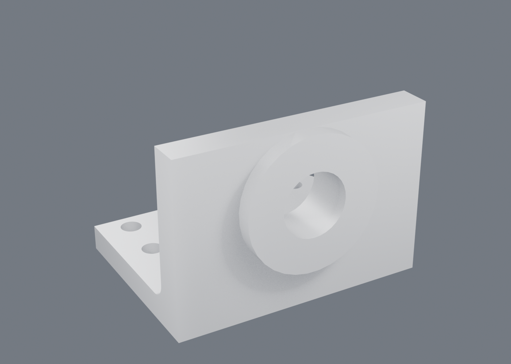

# Drawings, printing and what a part is made of

[← README](../README.md)

## Printing

A part that cannot leave as a mesh cannot be printed, so it can:

```bash
python -m cadcore mesh        examples/bracket.json --out part.3mf
python -m cadcore print-check examples/bracket.json --wall 2 --hole 3
```

`drawing --out x.dxf` writes the same views as DXF for a laser cutter (visible
and hidden on separate layers), and `export --out x.igs` writes IGES for the
shops that still ask for it.

STL, 3MF, OBJ and glTF (`.gltf` or `.glb`) come from the same tessellation
the viewport shows, so what the slicer opens is what was on screen; `.brep`
writes OCCT's own exact form. A mesh comes back in through `import_mesh` as
a real body (a face per facet, coplanar ones merged, a solid when it closes),
so a scan can be cut and filleted.

`draft_check` says, for a pull direction, the draft of every face, which ones
need more, and where a straight pull would catch (an undercut), by face name.
`mass_properties` gives the centre of mass and the inertia, in grams with the
material's density; `curvature` reads a face's principal radii at a point;
`section` the curves and area where a plane passes through. The check answers on the **CAD faces**, which
is the difference that matters -- a slicer reports triangles, and what a designer
needs is which feature to change:

    printability: build z up, 45 deg overhang limit
      unsupported 2732 of 23322 mm2 (11.7%)
      overhang  boss1/west                858.0 mm2 at 0.0 deg
      thin wall hole3/-y                   2.00 mm
      small hole hole3/bore                2.50 mm

Walls are *measured*, by shooting a ray from the surface into the solid and
taking the first face it genuinely crosses -- a grazing hit near a fillet would
otherwise report a wall a hundredth of a millimetre thick. Holes are only
reported when the face curves toward its own axis, because a thin pin is a
different problem. In the add-on the findings are painted onto the faces that
have them.

## The flat pattern

```
python -m cadcore unfold examples/sheet_bracket.json --out blank.dxf
```
```
flat pattern: 2.00 mm thick, 2 bend(s) adding 52.62 mm to the blank
  bend  edge                              angle   radius  allowance
  wall  plate/right|plate/top             90.0    2.50     5.309
  lip   wall/end|wall/face               -90.0    2.50     5.309
  blank 142.6 x 60.0 mm, 8557 mm2
```

The bend table tells the brake what to do. It does not tell the laser what to
cut, and until the outline came out of it the sheet metal claim stopped one
step short of a part anybody could make.

The outline is laid out from what the part **recorded**, not by unfolding the
solid: the base keeps its sketch's loop, and each flange keeps the line it was
bent on and how far it reached. That is the honest way round, because the
folded solid has no memory of how much material a bend ate — which is the
whole reason `bend_allowance` exists.

Two layers in the DXF, because they are two different instructions: `BLANK` is
cut and `BEND` is folded. A cutter handed both on one layer cuts the part into
strips.

One case is laid out and one is refused rather than guessed. A flange off the
base gets its direction by flattening what it recorded into the sheet's plane.
A flange off *another flap* cannot — its outward direction stands up out of the
sheet and the projection is zero, which laid a lip out as a line of no width.
It inherits its parent's direction instead, and sits at the parent's
**developed** end rather than where the folded geometry puts it. A flange bent
along the side of a flap rather than at its end gets no outline at all, which
is better than a wrong one.

## Measuring

```
python -m cadcore build part.json          # and from the viewport, or an agent:
session.op_measure(kind="linear", faces=["plate/top", "plate/bottom"])
{"kind": "linear", "faces": [...], "value": 5.0, "unit": "mm"}
```

`linear` is the distance between two planar faces along their common normal,
`angle` the angle between two faces *through the material* -- the one a
drawing dimensions, which is the supplement of the angle between their two
outward normals. `centres` is the distance between two cylinders' axes,
`diameter`, `radius` and `area` read one face. `op_measure_kinds` is the list
itself rather than a copy of it.

The measuring lives in one place and a drawing's dimensions call it, so a
number in a panel and a number on a sheet cannot disagree.

## Drawings

Views come from OCCT's hidden line removal, laid out in third angle. Dimensions
and tolerances are written against face names and **measured at draw time**, so
the sheet cannot disagree with the model: change the width and the number changes
with it.

```json
"drawing": {
  "views": ["front", "top", "right"],
  "datums": {"A": "plate/-z@0", "B": "plate/-x@0"},
  "dimensions": [
    {"view": "front", "type": "linear", "faces": ["plate/-x@0", "plate/+x@0"], "offset": -14},
    {"view": "front", "type": "diameter", "faces": ["bore_tool/side"], "offset": 20}
  ],
  "tolerances": [
    {"view": "front", "face": "bore_tool/side", "kind": "position", "value": 0.1,
     "diametral": true, "datums": ["A", "B"]}
  ],
  "title": {"part": "camera bracket", "material": "A6061-T6"}
}
```

Feature control frames carry the real symbols (position, flatness,
perpendicularity, concentricity, cylindricity, runout…), and a control naming a
datum that does not exist is refused rather than drawn. Output is plain SVG, or
DXF for the shops that ask for it.

**Sections** are where hidden lines stop being readable — a bored boss, a
shelled housing:

```json
"drawing": {"views": ["front", "top"], "sections": {"front": 0}}
```

The plane is a distance along that view's own normal, so "cut the front view
through the middle" keeps meaning that after the part changes; writing the plane
out in world coordinates would not. Hatching is clipped to the faces the cut
actually exposed, because hatching is what tells a reader they are looking at
material: a bore through a boss comes out as two bands, not one crossing the
hole.

## Assemblies



A `part` builds another document and scopes its names to itself; a `mate` moves
one part against another **by naming two faces**; an `assemble` is a compound,
not a boolean, because the parts have to stay separate solids for interference
to remain a question that can be asked.

```json
{"id": "bush", "type": "part", "document": "parts/bush.json",
 "parameters": {"outer_d": "2*(bore - clearance)"}},
{"id": "fitted", "type": "mate", "kind": "concentric", "move": "bush", "to": "base",
 "faces": ["bush:barrel/side", "base:bore_tool/side"], "offset": "seat"}
```

The assembly drives its parts, so "the bush is sized to the bore it goes into"
lives in the document instead of in a comment — and a part driven outside its own
declared envelope is refused with its own assert quoted back. Interference is a
volume, not a yes or no:

    $ python -m cadcore interference examples/assembly.json
    parts: base, fitted
    no interference

## Mates solved together, and the freedom they leave

A `mate` computes one transform, in order. That is honest, and it is enough for
one constraint, but it means a *second* mate on a part does not add to the
first — it replaces it — and it means nothing ever asks whether the placement
was the only one possible.

Listing the mates inside `assemble` solves them together instead:

```json
{"id": "asm", "type": "assemble", "bodies": ["base", "bush"], "ground": "base",
 "mates": [
   {"kind": "concentric", "faces": ["bush:barrel/side", "base:bore_tool/side"],
    "flip": false},
   {"kind": "planar", "faces": ["bush:flange/+z", "base:wall/-y@1"]}]}
```

Each part that is not the ground carries six unknowns; each mate contributes
equations that are zero when it is satisfied; the rank of the Jacobian at the
answer is what is actually held, so `6n − rank` is what is left over — and the
null space says what that freedom *is*:

    $ python -m cadcore freedom examples/assembly_solved.json
    7 equations, 5 of them independent, 1 degree of freedom left
      grounded on base
      bush                   1 free: turns about (0, 1, 0) through (0, 0, 34.1)
      redundant  concentric bush:barrel/side + base:bore_tool/side
      redundant  planar bush:flange/+z + base:wall/-y@1

Three things follow from writing it this way.

**An offset is a constraint only when you write one.** Left out of a
concentric mate the part slides along the bore, which is what a shaft in a
bearing does. The ordered `mate` cannot say that: it has to produce a
placement, so its offset defaults to zero and pins the part whether or not
anybody meant it to.

**The seat can be a face instead of a number.** `assembly.json` says
`seat: 10`, and its own note admits the number is measured from wherever OCCT
keeps the bore's origin. `assembly_solved.json` puts the flange against the
wall and lands in the same place, said in a way that survives the bore moving.

**And it survives the parts changing.** The mates name faces, so growing the
bore — which this document also passes down to the bracket — re-solves rather
than breaks: the bush is driven from the same parameter, still seats on the
same wall, and `python -m cadcore interference` is what says whether the two still fit.

**Leftover freedom is reported, never refused.** This is where an assembly
differs from a sketch, and the difference is in the subject rather than in the
method: a sketch that can still move is unfinished, and an assembly that can
still move is usually the mechanism. What *is* refused is `over_constrained` —
mates that cannot all be true at once, which is the assembly's version of a
sketch's conflicting dimensions. A redundant mate that agrees with the others
is reported and built, because it is usually somebody being explicit.

## The mate kinds

Every mate names two faces, the first on the part that moves. What it holds
is what the faces are:

| kind | faces | holds | leaves |
|---|---|---|---|
| `fastened` | flat, flat | the two faces together, centre on centre | nothing |
| `planar` | flat, flat | the faces parallel, `offset` apart | slides in the plane, turns about the normal |
| `concentric` | round, round | one axis; `offset` along it if written | turns; slides too without an offset |
| `parallel` | any two with a direction | the directions the same way | everything else |
| `perpendicular` | any two with a direction | the directions at right angles | everything else |
| `angle` | any two with a direction | the directions at `angle` degrees | everything else |
| `distance` | flat, round or a sphere | `offset` apart | what the shapes allow |
| `tangent` | round or a sphere, and flat or round | touching: outside with `flip`, inside without | what the shapes allow |
| `hinge` | round, round | one axis, and the two faces level with each other | one turn |
| `slider` | round, round | one axis, and no turn | one slide |
| `ball` | sphere, sphere | one centre | three turns |
| `gear` | round, round | axes parallel and apart, and the turns coupled: `ratio` turns of the first per turn of the second, from the radii when left out | one turn, shared |
| `screw` | round, round | one axis, and a turn advances `pitch` mm (`hand`: right or left) | one turn, with its advance |
| `belt` | round, round | axes parallel, the turns coupled the same way in the ratio of the radii; the centre distance only with an `offset` | one turn, shared |
| `slot` | round (the pin), flat (a side of the slot) | the pin's axis along the side, a radius off it (outside with `flip`) | slides along the side and the axis, turns |
| `cam` | round or a sphere (the follower), any face (the cam) | the follower touching the cam, read off the face itself | what the shapes allow |

A `hinge` takes `min` and `max` degrees and a `slider` `min` and `max` mm; a
drive that would go past them is refused, naming the mate and how far it got.

"Round" is a cylinder or a cone. A mate written against faces it cannot hold
is refused as `bad_mate_faces`, naming what it needs. `flip` turns the moving
part round: flat faces meet instead of pointing the same way, a pin goes into
a hole rather than out of it. The seed puts the parts where the mates say
before solving, orientation-fixing mates first, and a loop of hinges is
closed by a search over the spins before the polish, so a four-bar built from
four `hinge` mates closes with one freedom left.

## Driving what is left free

The freedom an assembly reports can be used. `drive` in the `assemble`
feature holds a part a set way along it, and the other parts follow:

```json
{"id": "asm", "type": "assemble", "bodies": ["frame", "crank", "coupler", "rocker"],
 "ground": "frame", "mates": [...four hinges...],
 "drive": [{"part": "crank", "turn": "crank_angle"}]}
```

`turn` is degrees, `slide` millimetres; `about` or `along` picks the axis when
the part has more than one. A parameter there is the mechanism's position, so
`examples/linkage.json` built at another `crank_angle` is the linkage in
another place, and the drive is walked there in steps so a closed chain stays
on the branch it started on. Without changing the document:

    $ python -m cadcore drive examples/linkage.json crank --turn 180 --frames 6 --collisions

answers the pose of every part along the way -- a rotation and an offset each
-- and which parts touch at each step. A part asked to move a way its mates
do not allow is refused as `no_freedom`, saying what the mates do leave.

## Seen apart

    $ python -m cadcore explode examples/linkage.json

is an offset per part that takes the assembly apart: each part moves out along
the axis or normal of the mate that holds it, away from the part it is mated
to, by a factor of its own size, and a pile of links comes apart in steps. A
drawing takes `"exploded": 1.5` in its spec and is drawn that way; the
document does not change.

## STEP as an assembly

An assembly is written as a STEP assembly: one product per part, named as
the document names it, a sub-assembly nested inside its parent. Another CAD
opens it as parts, and `import_step` reading such a file names the faces
under the part they came from (`base:imp/+z`), the way this kernel scopes its
own. One solid goes out as it always did. A part's `colour` and `material`
(on `part` and `fastener`, or the document's `meta`) go out with it and come
back in a STEP's notes; `heal: true` on an import sews gaps and closes shells.

## Studies of an assembly

A study declared on an assembly glues the parts wherever they touch -- no
slip, no gap, no contact that opens -- and analyses the one solid that
makes. A part that touches nothing cannot be glued and is refused as
`parts_not_touching`, because a study of it would float.

## Standard parts

```json
{"id": "screw", "type": "fastener", "standard": "M6", "kind": "socket_head", "length": 20}
```

makes an ISO 4762 screw, its head on the plane through `at` facing `axis`
and the shank the other way; `hex_bolt`, `nut` and `washer` are the other
kinds, and the sizes M3 to M12 are the ones the `hole` feature already knows,
so a screw fits the clearance hole of its size. Its faces are named for what
they are: `screw/under` is what a fastened mate puts on the washer,
`screw/shank` what a concentric mate puts in the hole. The bill of materials
lists it by its standard name.

## What an assembly is made of

```
$ python -m cadcore bom examples/assembly.json
bill of materials: 2 part(s)
  qty  part            material   volume mm^3      mass g
    1  base            A6061          69115.1      186.61
    1  bush            SUS304          8577.5       68.62
  total 255.23 g
```

Quantity is counted by *what a part is* — the document it came from, with the
parameters it was driven with — so two bushes bored to different sizes are two
lines and four of the same bush are one line with a four in it. That is the
distinction a purchase order cares about and a face count cannot make. The
material comes from the part, then from its own document, then from what it was
analysed as: each a weaker claim than the last, and the reply says which one it
found.

A pattern of a part counts its copies. A part whose document is itself an
assembly is one line with its own `parts` under it, so the bill nests as the
assembly does (`examples/assembly_nested.json` is two bracket-and-bush
assemblies on a rail, one with a bigger bore, so two lines), and `flat` lists
every leaf part with the quantities multiplied through. An assembly's drawing
sheet carries a numbered balloon per part and the parts list.
