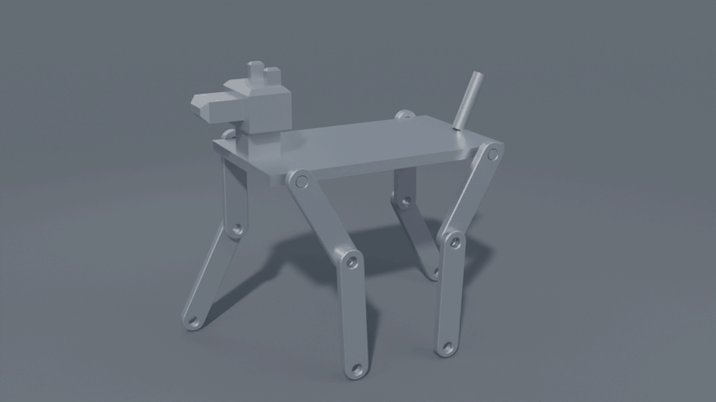

# A four-legged walker

[← README](../README.md)



Nine parts, eight joints, and one number per joint — sized to a Sony aibo
ERS-1000, which is **305 × 180 × 293 mm**. Standing, this measures
**305 × 180 × 293**; walking it crouches about a centimetre, because a leg
standing at its full length has nothing left to reach with.

The height is the one that needs saying. Reaching 293 mm with legs alone would
have taken 265 mm of leg on a 240 mm body, which is a spider. An aibo's 293 is
measured to the top of its *head*, so this has a neck and a head, the legs keep
a dog's proportions, and the number comes out where it should.

```
python -m cadcore build   examples/quadruped/robot.json
python -m cadcore freedom examples/quadruped/robot.json
blender -b -noaudio --factory-startup -P tools/render/render_quadruped.py \
    -- build/walk_frames 24
python tools/render/stitch.py build/walk_frames docs/images/walk.gif 20
```

For an MP4 rather than a GIF you need an `ffmpeg` on the path -- this Blender
is built without one, which is why `stitch.py` exists:

```
ffmpeg -framerate 24 -i build/walk_frames/f%04d.png \
    -filter_complex "loop=loop=3:size=48:start=0" \
    -c:v libx264 -pix_fmt yuv420p -crf 20 build/walk.mp4
```

## Every bone is the same part

`examples/mechanism/link.json` — a bar with a hole at each end — is the femur
*and* the tibia *and* every bar of every linkage in `docs/mechanisms.md`. The
legs differ by their `centres` parameter and nothing else. That is what a
parametric part is for, and it is why the robot adds one new document
(`parts/body.json`, the chassis with a hip pin at each corner) rather than
eight.

## A joint is a mate with an angle

```json
{"id": "hip_fl", "type": "mate", "kind": "concentric",
 "move": "femur_fl", "to": "body",
 "faces": ["femur_fl:pin_a/bore", "body:pin_fl/side"],
 "angle": "180 + hip_fl"}
```

The femur's bore goes on the body's pin, and the angle about that axis is a
document parameter. The knee is the same thing one link along: the tibia's bore
on the far end of the femur the hip has just placed.

**The 180 was measured, not chosen.** A concentric mate lines two axes up and
leaves the spin to `angle`, and zero is wherever the mate's own frame happens
to land — which for this part is the leg pointing straight *up*. Sweeping the
hip through a full turn and watching the femur's lowest point put the hanging
leg at 180°, so the document carries the offset and the parameter reads 0 for a
leg hanging straight down. A joint angle that does not mean anything is a joint
angle nobody can write a gait for.

## A gait is eight numbers a frame

`gait.py` walks it as a **trot**: the diagonal pairs move together, half a
cycle apart, so two feet are always down and always opposite corners — the gait
that needs no balancing. Each foot is given a path rather than each joint an
angle: a straight 96 mm push along the ground while it carries, and a 30 mm
lifted arc back to the front while it does not. The two joints are then solved
for, per foot, per frame.

Which way the knee folds is a per-leg choice, and it is most of what tells a
front leg from a back one: the same triangle has two roots, so the front pair
bend their knees back and the rear pair bend theirs forward — an elbow and a
stifle.

Nothing about that is animation data. It is eight parameters fed to the same
kernel that builds the part, and what comes out is the assembly solved at that
pose, with the same face names it has at any other pose.

## The foot did not touch the ground

Not for half its stance, anyway. The first gait turned the hip through ±26°
with the knee held at zero — and a straight leg swung about one pin traces a
**circle**, not a floor:

| hip | 0 | ±13° | ±26° |
|---|---|---|---|
| foot | −205.4 | −203.1 | −196.4 mm |

Nine millimetres of tiptoe at each end of the step, flat in the middle. It
does not show in a still and it is obvious in motion.

The cure is not a better pair of angle curves. It is to say where the *foot*
goes — flat along the ground while it carries, an arc while it does not — and
let the two joints follow, which is inverse kinematics and needs the leg's real
convention. That convention was not the one this document claimed:

> **`knee` is the shin's angle from vertical, not from the thigh.**

A mate turns the moved part about the *target* axis, and the knee's target is
the femur's bore, whose direction does not change when the hip turns. So hip
26° with knee 0 is a thigh swung forward under a shin still hanging plumb. The
note in the document said the opposite, the first gait believed it, and the
kernel had been right all along — a two-link model built on the measured
convention agrees with it to **0.1 mm**.

With the foot placed instead of the joints, the planted foot now holds to
**0.18 mm** over a full cycle. The remaining fifth of a millimetre is the
sole's contact point rolling round its own radius as the shin leans, which is
a real thing a round foot does.

The gait lives in `tools/render/gait.py`, apart from the renderer and free of
`bpy`, so the test can walk the robot and ask the kernel where the foot ended
up.

## The legs walked through each other

The front and back feet met, and the fix was not the legs.

`hip_dx` — where the chassis puts its four hip pins — was never passed from the
assembly, so it stayed at the part's own default of 55 mm. That put the pins
110 mm apart in the middle of a plate more than twice as long, while each leg
is 192 mm and swings ±26°, which sweeps a foot ±84 mm. Two feet 110 apart,
each sweeping 168, walk through each other; the deepest overlap was 4.9 cm³ of
tibia through tibia. The chassis says *a hip pin at each corner*, and the
assembly was the thing not saying where the corners were:

```json
"hip_dx": "body_len/2 - hip_inset"
```

There was a second overlap under it, and it never moved, which is why it never
looked like one: a concentric mate makes two bores coaxial and nothing else,
so the femur and the tibia — two flat 8 mm bars — sat in the *same plane* and
shared 2.6 cm³ at every pose of every leg. A lap joint is offset by a
thickness, and the mate has always taken an `offset`; nobody had written one.
The sign is per side, because one scalar along the bore is outboard on the left
and inboard on the right.

Neither of these is visible in a still. Both are one command:

```
python -m cadcore interference examples/quadruped/robot.json
```

which is now clear at every pose of the gait, and is checked at the worst of
them by a test — the pose found by sweeping, not by picking.

## Two things the robot taught the kernel

**A pose is one thing.** Setting eight angles one at a time is eight rebuilds —
and seven of the eight robots are half in the previous pose. A 24-frame walk
was 192 rebuilds. `op_set_parameters` takes them together: **348 ms to 12 ms**,
and it is refused as a whole, so a typo in the eighth angle does not leave the
first seven applied.

**A camera clips in the model's units.** The ground stopped at a line a
handful of centimetres behind the robot, and past it was flat world colour --
which reads as a grey wall, not as a missing floor. It was the camera's far
clip plane: this model is in millimetres, so the part is 300 units long, the
camera sits 950 units back, and Blender's default `clip_end` lands just past
it. Every render script here now sets `clip_start` and `clip_end` from the
model's own size, like everything else in the scene. Making the floor sixty
times bigger, which was my first guess, changed nothing at all -- the floor was
never the limit.

**EEVEE needs a display even with `-b`.** It does not fail without one; it
hangs — an empty 160×160 frame never came back. The render uses Cycles on the
CPU, which touches no display at all.
